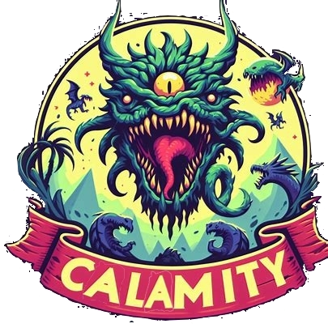
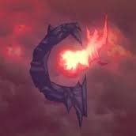

<html>
<head>

<h1 style="font-size: 45px; text-align: center; color: rgb(144,21,30)">WikiCalamity</h1>
</head>
<body>

    
    

    

    WikiCalamity es una enciclopedia basada en el mod Calamity del juego Terraria 
    Este mod es conocido por su extensa variedad de contenido adicional, que incluye nuevas armas, enemigos, jefes y biomas. 
    La enciclopedia WikiCalamity proporciona información detallada sobre todos estos elementos
    

    

    En WikiCalamity, los usuarios pueden encontrar descripciones detalladas de cada elemento nuevo introducido por el mod, 
    desde armas poderosas hasta equipos y accesorios especializados. 
    Además, la enciclopedia ofrece información sobre cómo obtener estos elementos, así como sus estadísticas, efectos y usos en combate.
    

    

    La enciclopedia también incluye artículos sobre los numerosos jefes adicionales que presenta Calamity, 
    ofrecen detalles sobre los biomas agregados por el mod, junto con información sobre los enemigos únicos que los habitan.
    

    <h3 style="text-align: center;">WikiCalamity es una valiosa fuente de información para los jugadores de Terraria que desean explorar y dominar el emocionante contenido adicional que ofrece el mod Calamity.</h3>
</body>
</html>